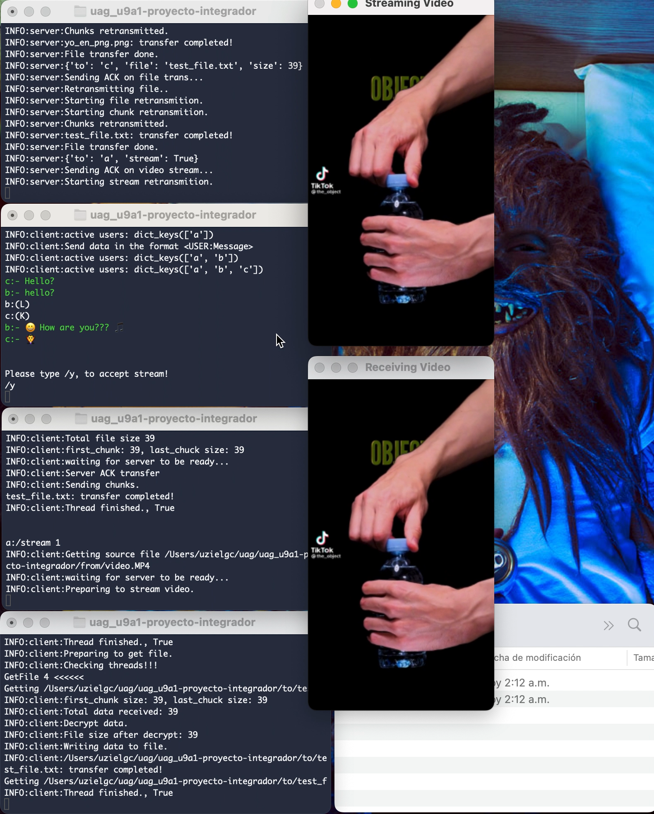
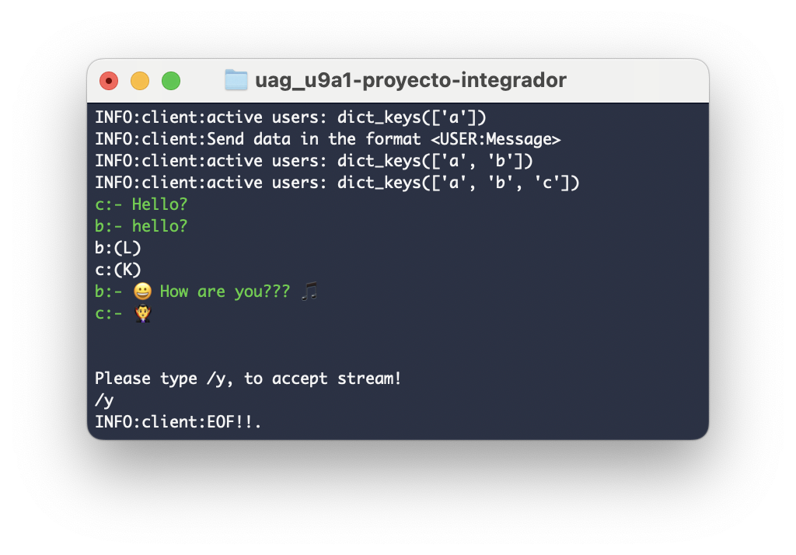
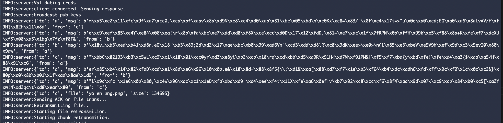

## uag_u9a1-proyecto-integrador
### Author: Eloy Uziel García Cisneros (eloy.garcia@edu.uag.mx)
#### Repo: https://github.com/uzielgc/uag_u9a1-proyecto-integrador

## Documentación

```
src/
  |-- network.py
  |-- client.py
  |-- server.py
  |__ node.py
from/
to/
media/

```
### network.py

* Crypto: Crea llaves privada y pública RSA y proveé funciones de encriptado y desencriptado.
* User:  Es la representación de un usuario, almacena nombre de usuario y hashed pass.
* Network: Clase base para los sockets TCP.

### server.py
* Server: Extiende el funcionamiento de la clase "Network" e implementa funciones propias del servidor; maneja los clientes y distribuye los mensajes.

### client.py
* Client: Es responsable de establecer la conexión con el servidor e intercambia la llave publica con los demas nodos. Encripta y envia mensajes, recibe y decripta.

Al correr el nodo servidor se crea un thread para introducir comandos y monitorear los usuarios.

```
/db: lista los usuarios registrados.
/active: lista los usuarios conectados.
/info: Lista los hilos existentes.
```

Al correr el nodo client se crea un thread para introducir comandos ademas de enviar los mensajes al servidor.

```
/ls: lista los archivos disponibles en la carpeta from
/send: envía el archivo selecionado. uso: <target_user>:/send <id archivo>
/stream: Envia el archivo de video seleccionado en stream. uso: <target_user>:/stream <id archivo>
```

El código fuente se encuentra en la carpeta [src](src).

La evidencia en imagenes y/o video se encuentra en la carpeta [media](media).

El código esta comentado en los puntos clave del proceso.

### How to Run

Crear server:
```
python src/node.py -s
```

Inicializar cada uno de los clientes.
```
python src/node.py
```

*NOTA: instalar los requerimientos previo a ejecución:
```
pip install -r requirements.txt
```


[](media/u9.mov "Video Demo")

* Click en la imagen para ir al video demo. (media/u9.mov)^



Mensajes emojis 


Mensajes encriptados 

### Output:

Terminal 1 server:
```
uzielgc:~$ python src/node.py -s
INFO:network:Starting server console.
INFO:network:Starting server, waiting for incomming conn.
INFO:network:Client connected ('127.0.0.1', 62414)
INFO:network:Waiting for client credentials
INFO:network:Validating creds
INFO:network:client connected. Sending response.
INFO:network:broadcast pub keys
INFO:network:Client connected ('127.0.0.1', 62416)
INFO:network:Waiting for client credentials
INFO:network:Validating creds
INFO:network:client connected. Sending response.
INFO:network:broadcast pub keys
INFO:network:Client connected ('127.0.0.1', 62417)
INFO:network:Waiting for client credentials
INFO:network:Validating creds
INFO:network:client connected. Sending response.
INFO:network:broadcast pub keys
INFO:network:{'to': 'user1', 'msg': b'h/\x8cs\x00\xfb\xf5=\xff\x1b@\xa9\x1f\xc7|\xc6"\xa5\xa0\xd6P\xde"$Vrm=iy\xf6\xd5\x9b!g\xbc\x95\xeb\xe7\xf0\xd1\x08?\xb4\xcc9\x1d\xdao\xf0\xd6\x93Z\xbf\xf8\xf4\xd2\xa1\x86\xabi\x86\x91\xa2'}
INFO:network:{'to': 'user1', 'msg': b'o\xf4b\x19[Q\xee\x1a\x13\x18}K\xa1\xf1w\xb6,9s\xd0\x16\xd68,\xfb\t\t\x1e\xf5\xe0vy\x89\xb6\x83\x92\xd5\xe4|\x84\xe3\xb0x\xd2a\xc8\x8e\xc6\xf6\x9eZ\x97\x7f\x0e\x81\xbfr\x9f%0@Ey\x9f'}
INFO:network:{'to': 'user3', 'msg': b'@ _\xefM?\x8e\x81\xfe\xff\xf6\x904\xa8\xce=\xa0Gj\xdb\xdb\xa5\xd9\xc2\xde\xae\x16w\x8e\x9b\x02_\xf2G\xd0/\xaf\xc0R\xb1\x86f\xbdgL\xcf\xf07\xb1\x85\x0f\xd9\x91\xda)\x87\xaa*9\x146f\xea\x00'}
INFO:network:{'to': 'user1', 'msg': b'D\xa5\xbc\xc8\x87\xcd\t\xfa\xa4:.\xd9\xcf\x8cG\xd8\xa1\xc6\x98\x8b\xac\x12S\xcf\x9c\x01\xcd\xe8\x99\x90N8#mn&\xae\x1c\x18\x00\x81\xc0\xae?\x04?R\xa7\xd1J\x1a\xf6\xd47\xc6X\xc1\xdf\xa9\xc2\xea\x97\x03\x8e'}
INFO:network:{'to': 'user2', 'msg': b'%\xb0\xb9\x89\x95H\xf4P\x96\xd2\xadJ\xfe\xd3\xa5\x04K!\xe5\x9a]m\x1f\xd2\xd0\x02.\x13\xdc\x84\x98\x95A\xa0&\xbd\xa7Hi\xf3f#\x0f\xba\x9b\xda:\xff\xf4\\\xd6\xb8p\xc8\xd2\xd8}Rk\xdfo\xb3\x0e['}
INFO:network:broadcast pub keys
INFO:network:Client connected ('127.0.0.1', 62423)
INFO:network:Waiting for client credentials
INFO:network:Validating creds
WARNING:network:Unable to accept client.
db
INFO:network:{'user1': 'd74ff0ee8da3b9806b18c877dbf29bbde50b5bd8e4dad7a3a725000feb82e8f1', 'user2': 'd74ff0ee8da3b9806b18c877dbf29bbde50b5bd8e4dad7a3a725000feb82e8f1', 'user3': 'd74ff0ee8da3b9806b18c877dbf29bbde50b5bd8e4dad7a3a725000feb82e8f1'}
active
INFO:network:dict_keys(['user1', 'user2'])
INFO:network:Client connected ('127.0.0.1', 62424)
INFO:network:Waiting for client credentials
INFO:network:Validating creds
INFO:network:client connected. Sending response.
INFO:network:broadcast pub keys
INFO:network:{'to': 'user1', 'msg': b'\x85\x9a\x05]F7\xb8\xd9\x0c&\xcf\x98Y7\xc2[\x12A\x93\x95S\xc8\xc3\x06\xb6%\xc7{\xe7b\xf2\x0b\xe2\xc4\x8e\xe6\xe0\xc0\xf9\xfa\t\x80\xb80&\x9e!s\x95\xd7\x11\xc0\xacdq\xdb~q\xac\xbf[}\x958'}

INFO:network:available cmds: dict_keys(['db', 'active'])
db
INFO:network:{'user1': 'd74ff0ee8da3b9806b18c877dbf29bbde50b5bd8e4dad7a3a725000feb82e8f1', 'user2': 'd74ff0ee8da3b9806b18c877dbf29bbde50b5bd8e4dad7a3a725000feb82e8f1', 'user3': 'd74ff0ee8da3b9806b18c877dbf29bbde50b5bd8e4dad7a3a725000feb82e8f1'}
active
INFO:network:dict_keys(['user1', 'user2', 'user3'])
```

Terminal - server:
```
uzielgc:~$ python src/node.py -s
INFO:server:Starting server console.
INFO:server:Starting server, waiting for incomming conn.
INFO:server:Client connected ('127.0.0.1', 52432)
INFO:server:Waiting for client credentials
INFO:server:Validating creds
INFO:server:client connected. Sending response.
INFO:server:broadcast pub keys
INFO:server:Client connected ('127.0.0.1', 52433)
INFO:server:Waiting for client credentials
INFO:server:Validating creds
INFO:server:client connected. Sending response.
INFO:server:broadcast pub keys
INFO:server:Client connected ('127.0.0.1', 52434)
INFO:server:Waiting for client credentials
INFO:server:Validating creds
INFO:server:client connected. Sending response.
INFO:server:broadcast pub keys
INFO:server:{'to': 'a', 'msg': b'm\xa5\xe2\x11\xfc\x9f\xd7\xcc0.\xca\xbf\xdav\x8a\xd9N\xe8\xe4\xd0\xdb\x81\xbe\x05\xbd\n\xe0Kx\xc8=\x83/[\x0f\xe4\x17i=>"u\x0e\xa0\xcd;EQ\xa0\xd6\x8alv#V/f\xf9H)\x82H\x11\x8d', 'from': 'c'}
INFO:server:{'to': 'a', 'msg': b'e\xc9\xef\x85\xe4Y\xe8^\x06\xea!\r\x8b\xfd\xbc\xe7\xdd\xd8\xf8X\xce\xcc\xd0D\x17\x12\xfdD,\x81=\xe7\xac\x1f\x7fRPN\x0b\xffH\x99k\xe5\xf88\x8a+K\xfe\xf7\xdcXU\xf5\x08\xa5\x1bg\x7fz\xf8F&', 'from': 'b'}
INFO:server:{'to': 'b', 'msg': b'\x18v_\xb3\xed\xb4J\xd8r.eO\x18 \xb3\x89;2d\xd2\x17\xae\xbc\xb0\x99\xad6Vn"\xcd3\xdd\xd8lR\xc8\x9dK\xee>\xe0>\n(l\x85\xe3\xbeV\xe9V9h\xef\x9d\xc3\x9evI0\x80\x9dw', 'from': 'a'}
INFO:server:{'to': 'c', 'msg': b'"\xbbC\x82193\xb3\xc5wL\xc9\xc1\x18\x01\xcc@yr\xd3\xe8yi\xb2\xcb\x18\rq\xcd\xbb\xd5\xd9R\x91H<\xd7M\xf91PM&|\xf5\xf7\xba{y\xbd\xfe!\xfe\xd4\xa3{$\xda\xa5/H\x88\x91\xc6', 'from': 'a'}
INFO:server:{'to': 'a', 'msg': b'er\x85\xb4\x14\x82\xfaD\xcd\xe1\x8d\xe6\x96\x10\x0b.e&\x18\x8d=\x88\x8f5{\\;\xd1&\xca[\x88\xd7\xf7\x1e\xb3\xf6^\xb4\xdc\xadh6\xfd\xff\x9c\xf9\x1c\x0c\xc2&}\x80p\xc0\x8b\xb01\x1f\xaa\x8aW\x1d9', 'from': 'b'}
INFO:server:{'to': 'a', 'msg': b'"l\x9c\xfc \x1eG\x0b\x80,\xc4w\x96\xac\xc1\x1eD\xfa\xba\xd9 \xd4\xee\xf4t\x11X\xfe\xa6\x0ef|v\xb7\x92\xc8\xcc\xf6\x8f4\xad\x9d\x07<\xc9\xcb\x84\xb0\xc5[\xa2Yxw!N\xd2qc\t\xd8\xean\x80', 'from': 'c'}
INFO:server:{'to': 'c', 'file': 'yo_en_png.png', 'size': 134695}
INFO:server:Sending ACK on file trans...
INFO:server:Retransmitting file..
INFO:server:Starting file retransmition.
INFO:server:Starting chunk retransmition.
INFO:server:Chunks retransmitted.
INFO:server:yo_en_png.png: transfer completed!
INFO:server:File transfer done.
INFO:server:{'to': 'c', 'file': 'test_file.txt', 'size': 39}
INFO:server:Sending ACK on file trans...
INFO:server:Retransmitting file..
INFO:server:Starting file retransmition.
INFO:server:Starting chunk retransmition.
INFO:server:Chunks retransmitted.
INFO:server:test_file.txt: transfer completed!
INFO:server:File transfer done.
INFO:server:{'to': 'a', 'stream': True}
INFO:server:Sending ACK on video stream...
INFO:server:Starting stream retransmition.
```

Terminal - client (a):
```
uzielgc:~$ python src/node.py
Sign-in/Sign-up.. Press ENTER when done.
USER: a
PWD: 
INFO:client:Connected to server.
INFO:client:Sending cred data.
INFO:client:Waiting for server response.
INFO:client:{'msg': 'Welcome a'}
INFO:client:starting listener.
INFO:client:active users: dict_keys(['a'])
INFO:client:Send data in the format <USER:Message>
INFO:client:active users: dict_keys(['a', 'b'])
INFO:client:active users: dict_keys(['a', 'b', 'c'])
c:- Hello?
b:- hello?
b:(L)
c:(K)
b:- 😀 How are you??? 🎵
c:- 🧛‍♂️

Please type /y, to accept stream!
/y
INFO:client:EOF!!.
```

Terminal - client2 (b):
```
uzielgc:~$ python src/node.py
Sign-in/Sign-up.. Press ENTER when done.
USER: b
PWD: 
INFO:client:Connected to server.
INFO:client:Sending cred data.
INFO:client:Waiting for server response.
INFO:client:{'msg': 'Welcome b'}
INFO:client:starting listener.
INFO:client:active users: dict_keys(['a', 'b'])
INFO:client:Send data in the format <USER:Message>
INFO:client:active users: dict_keys(['a', 'b', 'c'])
a:hello?
a:- ♥️ 
a::) How are you??? (8)

/ls
{
    "0": "yo_en_png.png",
    "1": "video.MP4",
    "2": "test_file.txt"
}

c:/send 0
INFO:client:Preparing yo_en_png.png
INFO:client:Total file size 134695
INFO:client:first_chunk: 4096, last_chuck size: 3623
INFO:client:waiting for server to be ready...
INFO:client:Server ACK transfer
INFO:client:Sending chunks.
yo_en_png.png: transfer completed!
INFO:client:Thread finished., True


c:/send 2
INFO:client:Preparing test_file.txt
INFO:client:Total file size 39
INFO:client:first_chunk: 39, last_chuck size: 39
INFO:client:waiting for server to be ready...
INFO:client:Server ACK transfer
INFO:client:Sending chunks.
test_file.txt: transfer completed!
INFO:client:Thread finished., True


a:/stream 1
INFO:client:Getting source file /Users/uzielgc/uag/uag_u9a1-proyecto-integrador/from/video.MP4
INFO:client:waiting for server to be ready...
INFO:client:Preparing to stream video.
```

Terminal - client3 (c):
```
uzielgc:~$ python src/node.py
Sign-in/Sign-up.. Press ENTER when done.
USER: c
PWD: 
INFO:client:Connected to server.
INFO:client:Sending cred data.
INFO:client:Waiting for server response.
INFO:client:{'msg': 'Welcome c'}
INFO:client:starting listener.
INFO:client:Send data in the format <USER:Message>
INFO:client:active users: dict_keys(['a', 'b', 'c'])
/info
Console True False
Listener True True

a:Hello?
a:- 💋
a::[
INFO:client:Preparing to get file.
INFO:client:Checking threads!!!
GetFile 3 <<<<<<
Getting /Users/uzielgc/uag/uag_u9a1-proyecto-integrador/to/yo_en_INFO:client:first_chunk size: 4096, last_chuck size: 3623
INFO:client:Total data received: 134695
INFO:client:Decrypt data.
INFO:client:File size after decrypt: 134695
INFO:client:Writing data to file.
INFO:client:/Users/uzielgc/uag/uag_u9a1-proyecto-integrador/to/yo_en_png.png: transfer completed!
Getting /Users/uzielgc/uag/uag_u9a1-proyecto-integrador/to/yo_en_
INFO:client:Thread finished., True
INFO:client:Preparing to get file.
INFO:client:Checking threads!!!
GetFile 4 <<<<<<
Getting /Users/uzielgc/uag/uag_u9a1-proyecto-integrador/to/test_fINFO:client:first_chunk size: 39, last_chuck size: 39
INFO:client:Total data received: 39
INFO:client:Decrypt data.
INFO:client:File size after decrypt: 39
INFO:client:Writing data to file.
INFO:client:/Users/uzielgc/uag/uag_u9a1-proyecto-integrador/to/test_file.txt: transfer completed!
Getting /Users/uzielgc/uag/uag_u9a1-proyecto-integrador/to/test_f
INFO:client:Thread finished., True
```